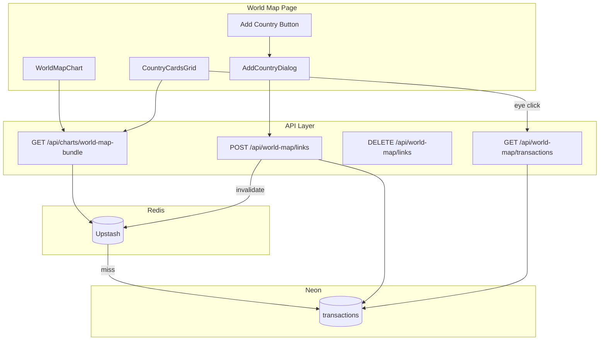

# World Map Complete Implementation Plan

## Overview

This plan covers the complete World Map feature:
1. **Database** — Add `country_name` column to `transactions`
2. **API Routes** — Bundle API, link/unlink endpoints
3. **Caching** — Redis caching with invalidation
4. **UI Components** — Country cards, Add button, search popup, transaction linking

---

## Current State

- **Database (Neon)**: `transactions` table has `id`, `user_id`, `tx_date`, `description`, `amount`, `category_id`, etc. **No country column yet.**
- **World map page**: [`WorldMapPage.tsx`](app/world-map/_page/WorldMapPage.tsx) uses hardcoded `SAMPLE_COUNTRY_DATA`
- **GeoJSON**: [`world-countries.json`](lib/data/world-countries.json) has country names in `properties.name` (e.g., "France", "United States of America")

---

## 1. Database Schema Changes

### Migration SQL (Run Manually in Neon Console)

```sql
-- 1. Add country_name column to transactions table
ALTER TABLE transactions
ADD COLUMN country_name text NULL;

-- 2. Add partial index for fast country aggregation queries
CREATE INDEX idx_transactions_user_country
ON transactions (user_id, country_name)
WHERE country_name IS NOT NULL;
```

### Column Details

| Column | Type | Notes |
|--------|------|-------|
| `country_name` | text NULL | Must match GeoJSON `properties.name` exactly |

### Key Queries

```sql
-- Get countries with spending totals (for map + cards)
SELECT country_name AS id, COALESCE(SUM(ABS(amount)), 0) AS value
FROM transactions
WHERE user_id = $1 AND country_name IS NOT NULL AND amount < 0
GROUP BY country_name;

-- Link transactions to a country
UPDATE transactions
SET country_name = $1, updated_at = now()
WHERE id = ANY($2) AND user_id = $3;

-- Unlink transactions
UPDATE transactions
SET country_name = NULL, updated_at = now()
WHERE id = ANY($1) AND user_id = $2;

-- Get transactions for a specific country
SELECT id, tx_date, description, amount, category_id
FROM transactions
WHERE user_id = $1 AND country_name = $2
ORDER BY tx_date DESC;
```

---

## 2. API Routes

### 2.1 World Map Bundle API

**Route:** `GET /api/charts/world-map-bundle`

**File:** `app/api/charts/world-map-bundle/route.ts`

**Response:**
```typescript
interface WorldMapBundleResponse {
  countries: CountryData[]  // { id: country_name, value: total_spent }
  stats: {
    totalCountries: number
    totalSpentAbroad: number
    topCountry: { name: string; value: number } | null
  }
}
```

**Implementation:**
- Use `getCachedOrCompute()` with `buildCacheKey('world-map', userId, null, 'bundle')`
- TTL: 5 minutes (same as analytics)
- Run aggregation query, compute stats

---

### 2.2 Link Transactions API

**Route:** `POST /api/world-map/links`

**File:** `app/api/world-map/links/route.ts`

**Request Body:**
```typescript
{
  country_name: string       // Must match GeoJSON name exactly
  transaction_ids: number[]  // IDs of transactions to link
}
```

**Implementation:**
1. Validate `country_name` exists in GeoJSON
2. Validate `transaction_ids` is non-empty
3. Run UPDATE with ownership check
4. Invalidate cache: `invalidateUserCachePrefix(userId, 'world-map')`
5. Return success with affected count

---

### 2.3 Unlink Transactions API

**Route:** `DELETE /api/world-map/links`

**File:** `app/api/world-map/links/route.ts`

**Request Body:**
```typescript
{
  transaction_ids: number[]
}
```

**Implementation:**
1. Run UPDATE setting `country_name = NULL, updated_at = now()`
2. Invalidate cache
3. Return success

---

### 2.4 Get Country Transactions API

**Route:** `GET /api/world-map/transactions?country=France`

**File:** `app/api/world-map/transactions/route.ts`

**Response:**
```typescript
{
  transactions: {
    id: number
    tx_date: string
    description: string
    amount: number
    category_id: number | null
  }[]
}
```

---

### 2.5 Get Unlinked Transactions API (for linking popup)

**Route:** `GET /api/world-map/unlinked-transactions`

**File:** `app/api/world-map/unlinked-transactions/route.ts`

**Query Params:** `?search=coffee&limit=50`

**Response:** List of transactions where `country_name IS NULL`

---

## 3. Caching Configuration

### Update `lib/cache/upstash.ts`

Add to `CACHE_PREFIX`:
```typescript
'world-map': 'world-map',
```

Add to `CACHE_TTL`:
```typescript
'world-map': 5 * 60,  // 5 minutes
```

### Cache Key Format
```
user:{userId}:world-map:bundle
```

### Invalidation Points

| After... | Call |
|----------|------|
| `POST /api/world-map/links` | `invalidateUserCachePrefix(userId, 'world-map')` |
| `DELETE /api/world-map/links` | `invalidateUserCachePrefix(userId, 'world-map')` |
| Transaction delete (existing) | Add `world-map` to existing invalidation |
| Statement delete (existing) | Add `world-map` to existing invalidation |

---

## 4. UI Components

### 4.1 Country Cards Grid

**File:** `app/world-map/_page/components/CountryCardsGrid.tsx`

**Layout:** Grid of country cards below the world map

**Each Card Shows:**
```
┌─────────────────────────────────┐
│ 🇫🇷  (flag, top-left)           │
│                                 │
│      France (top-center)        │
│                                 │
│   ┌─────────────────────┐      │
│   │                     │      │
│   │  [Country Outline]  │      │
│   │                     │      │
│   └─────────────────────┘      │
│                                 │
│      €1,234.56 (bottom)        │
│                           👁️   │
└─────────────────────────────────┘
```

**Card Elements:**
- **Flag** (top-left): Small country flag using emoji or flag icon library
- **Country Name** (top-center): Bold text
- **Country Outline** (center): SVG silhouette of the country shape
- **Total Spent** (bottom-center): Formatted currency amount
- **Eye Button** (bottom-right): Opens transaction list dialog

---

### 4.2 Add Country Button

**File:** `app/world-map/_page/components/AddCountryButton.tsx`

**Location:** Below the world map, before the cards grid

**Appearance:**
- "Add +" button with plus icon
- Matches existing button styles (shadcn Button)

**Behavior:** Opens AddCountryDialog on click

---

### 4.3 Add Country Dialog

**File:** `app/world-map/_page/components/AddCountryDialog.tsx`

**UI:**
```
┌──────────────────────────────────────┐
│  Add Country                    ✕    │
├──────────────────────────────────────┤
│                                      │
│  🔍 [Search for country...]          │
│                                      │
│  ┌────────────────────────────────┐ │
│  │ ○ France                       │ │
│  │ ○ French Polynesia             │ │
│  │ ○ French Southern Territories  │ │
│  └────────────────────────────────┘ │
│                                      │
│  Selected: France                    │
│                                      │
│  Select Transactions:               │
│  ┌────────────────────────────────┐ │
│  │ 🔍 [Filter transactions...]    │ │
│  │ ☑ 2024-01-15 Cafe Paris  -€12  │ │
│  │ ☐ 2024-01-14 Train      -€45   │ │
│  │ ☑ 2024-01-14 Hotel      -€120  │ │
│  └────────────────────────────────┘ │
│                                      │
│       [Cancel]        [Add]          │
└──────────────────────────────────────┘
```

**Behavior:**
1. User searches for country in dropdown
2. Country list filters based on search (from GeoJSON)
3. User selects a country
4. Transactions list shows unlinked transactions
5. User checks transactions to link
6. **Cancel** closes dialog
7. **Add** calls `POST /api/world-map/links` with selected country + transaction IDs

---

### 4.4 Country Transactions Dialog

**File:** `app/world-map/_page/components/CountryTransactionsDialog.tsx`

**Trigger:** Eye button on country card

**UI:**
```
┌──────────────────────────────────────┐
│  🇫🇷 France Transactions        ✕    │
├──────────────────────────────────────┤
│  Total: €1,234.56                    │
│                                      │
│  ┌────────────────────────────────┐ │
│  │ 2024-01-15  Cafe Paris   -€12  │ │
│  │ 2024-01-14  Hotel Nice  -€120  │ │
│  │ 2024-01-13  Train SNCF   -€45  │ │
│  │ ...                            │ │
│  └────────────────────────────────┘ │
│                                      │
│                          [Close]     │
└──────────────────────────────────────┘
```

**Data:** Fetches from `GET /api/world-map/transactions?country=France`

---

### 4.5 Country Card Component

**File:** `app/world-map/_page/components/CountryCard.tsx`

**Props:**
```typescript
interface CountryCardProps {
  countryName: string
  countryCode: string  // ISO code for flag
  totalSpent: number
  currency: string
  onViewTransactions: () => void
}
```

**Features:**
- Uses `React.memo` for performance
- Displays country outline SVG (can use simplified country shapes or skip initially)
- Flag from emoji or library (e.g., `flag-icons` CSS library)

---

### 4.6 Country Search/Select Component

**File:** `app/world-map/_page/components/CountrySelect.tsx`

**Features:**
- Searchable dropdown using shadcn Combobox or Command
- Lists all countries from GeoJSON
- Fuzzy search on country names

---

## 5. Types

### File: `lib/types/world-map.ts`

```typescript
export interface CountryData {
  id: string    // country_name (matches GeoJSON)
  value: number // total spent
}

export interface WorldMapStats {
  totalCountries: number
  totalSpentAbroad: number
  topCountry: { name: string; value: number } | null
}

export interface WorldMapBundleResponse {
  countries: CountryData[]
  stats: WorldMapStats
}

export interface CountryCardData extends CountryData {
  countryCode: string  // ISO 2-letter code for flag
}

export interface LinkTransactionsRequest {
  country_name: string
  transaction_ids: number[]
}

export interface UnlinkTransactionsRequest {
  transaction_ids: number[]
}
```

---

## 6. Styling & Theme Consistency

### CRITICAL: Match existing app styling

All World Map components MUST use the same patterns as other pages.

### Currency Formatting

**Use the `useCurrency` hook from `CurrencyProvider`:**

```typescript
import { useCurrency } from "@/components/currency-provider"

function CountryCard({ totalSpent }: Props) {
  const { formatCurrency } = useCurrency()

  return (
    <span>{formatCurrency(totalSpent)}</span>  // "€1,234.56" or "$1,234.56"
  )
}
```

**Options:**
```typescript
formatCurrency(amount, {
  minimumFractionDigits: 2,  // Default: 2
  maximumFractionDigits: 2,  // Default: 2
  showSign: false,           // Default: false (use for +/- display)
})
```

### Card Components

**Use existing shadcn Card from `components/ui/card.tsx`:**

```typescript
import { Card, CardHeader, CardTitle, CardContent, CardAction } from "@/components/ui/card"

// Country Card structure:
<Card className="relative">
  <CardHeader>
    <CardAction>
      <Badge variant="outline">{flag}</Badge>
    </CardAction>
    <CardTitle className="text-center">{countryName}</CardTitle>
  </CardHeader>
  <CardContent className="flex flex-col items-center gap-4">
    {/* Country outline SVG */}
    <div className="text-2xl font-semibold">
      {formatCurrency(totalSpent)}
    </div>
  </CardContent>
</Card>
```

**Card styling (automatic):**
- Light mode: 3D effect with subtle shadow (`card-3d-light` class)
- Dark mode: Clean flat appearance
- Border radius: `rounded-xl` (12px base)
- Padding: `py-6 px-6`

### Grid Layout

**Use container query responsive grid (like `section-cards.tsx`):**

```typescript
// CountryCardsGrid.tsx
<div className="grid grid-cols-1 gap-4 px-4 lg:px-6
  @xl/main:grid-cols-2
  @5xl/main:grid-cols-4">
  {countries.map(country => (
    <CountryCard key={country.id} {...country} />
  ))}
</div>
```

### Page Layout

**Match existing layout patterns (like HomeLayout):**

```typescript
// WorldMapPage structure:
<div className="flex-1 space-y-4 p-4 pt-0 lg:p-6 lg:pt-2">
  {/* World Map Chart */}
  <div className="px-4 lg:px-6">
    <WorldMapChart data={countries} />
  </div>

  {/* Add Country Button */}
  <div className="px-4 lg:px-6">
    <AddCountryButton onClick={() => setDialogOpen(true)} />
  </div>

  {/* Country Cards Grid */}
  <CountryCardsGrid countries={countries} />
</div>
```

### Button Styling

**Use existing shadcn Button variants:**

```typescript
import { Button } from "@/components/ui/button"
import { Plus } from "lucide-react"

// Add Country Button:
<Button variant="outline" size="sm">
  <Plus className="mr-2 h-4 w-4" />
  Add Country
</Button>
```

### Dialog Styling

**Use existing shadcn Dialog components:**

```typescript
import {
  Dialog, DialogContent, DialogHeader, DialogTitle,
  DialogFooter, DialogClose
} from "@/components/ui/dialog"

<Dialog open={open} onOpenChange={setOpen}>
  <DialogContent className="max-w-lg">
    <DialogHeader>
      <DialogTitle>Add Country</DialogTitle>
    </DialogHeader>
    {/* Content */}
    <DialogFooter>
      <DialogClose asChild>
        <Button variant="outline">Cancel</Button>
      </DialogClose>
      <Button onClick={handleAdd}>Add</Button>
    </DialogFooter>
  </DialogContent>
</Dialog>
```

### Color Palette

**Chart colors (from `globals.css` sunset palette):**

```typescript
// Use for country card accents or map highlights
const CHART_COLORS = {
  sunset: ["#331300", "#5e2401", "#8c3500", "#bb4903", "#e96113",
           "#fc833a", "#ffa66b", "#ffc49c", "#ffdcca", "#ffefe6"]
}

// Access via CSS variable:
// var(--chart-1) through var(--chart-10)
```

**Theme-aware colors:**
```typescript
// Primary: warm orange (light) / brighter orange (dark)
className="text-primary"  // or bg-primary

// Muted text:
className="text-muted-foreground"

// Card backgrounds:
className="bg-card text-card-foreground"
```

### Badge for Stats

```typescript
import { Badge } from "@/components/ui/badge"

// Country count badge:
<Badge variant="secondary">
  {totalCountries} countries
</Badge>

// Trend badge:
<Badge variant={isPositive ? "default" : "destructive"}>
  {formatCurrency(change, { showSign: true })}
</Badge>
```

### Loading States

**Use existing skeleton patterns:**

```typescript
import { Skeleton } from "@/components/ui/skeleton"

// Card skeleton:
<Card>
  <CardHeader>
    <Skeleton className="h-4 w-20" />
  </CardHeader>
  <CardContent>
    <Skeleton className="h-24 w-24 rounded-full mx-auto" />
    <Skeleton className="h-6 w-32 mx-auto mt-4" />
  </CardContent>
</Card>
```

### Empty State

**Match existing empty states:**

```typescript
<Card className="flex flex-col items-center justify-center py-12">
  <Globe className="h-12 w-12 text-muted-foreground mb-4" />
  <p className="text-muted-foreground text-center">
    No countries added yet
  </p>
  <Button variant="outline" className="mt-4" onClick={onAdd}>
    <Plus className="mr-2 h-4 w-4" />
    Add your first country
  </Button>
</Card>
```

### Icons

**Use Lucide icons (already installed):**

```typescript
import { Eye, Plus, Globe, MapPin, X } from "lucide-react"

// Consistent sizing:
<Eye className="h-4 w-4" />      // Small (buttons, badges)
<Globe className="h-6 w-6" />    // Medium (card icons)
<MapPin className="h-12 w-12" /> // Large (empty states)
```

---

## 7. Country Code Mapping

### File: `lib/data/country-codes.ts`

Map GeoJSON country names to ISO codes for flags:

```typescript
export const COUNTRY_CODES: Record<string, string> = {
  "France": "FR",
  "United States of America": "US",
  "United Kingdom": "GB",
  "Germany": "DE",
  // ... all countries from GeoJSON
}

export function getCountryCode(countryName: string): string | undefined {
  return COUNTRY_CODES[countryName]
}
```

---

## 8. Data Flow



---

## 9. Implementation Order

### Phase 1: Database (Manual)
1. Run migration SQL in Neon Console

### Phase 2: Backend
1. Add cache config to `lib/cache/upstash.ts`
2. Create types in `lib/types/world-map.ts`
3. Create `GET /api/charts/world-map-bundle`
4. Create `POST /api/world-map/links`
5. Create `DELETE /api/world-map/links`
6. Create `GET /api/world-map/transactions`
7. Create `GET /api/world-map/unlinked-transactions`

### Phase 3: Frontend
1. Create country code mapping `lib/data/country-codes.ts`
2. Create `CountryCard` component
3. Create `CountryCardsGrid` component
4. Create `AddCountryButton` component
5. Create `CountrySelect` component
6. Create `AddCountryDialog` component
7. Create `CountryTransactionsDialog` component
8. Update `WorldMapPage` to use bundle API + new components

### Phase 4: Polish
1. Add loading states
2. Add error handling
3. Add empty states
4. Update documentation

---

## 10. Validation & Security

- **Country name validation:** Validate against GeoJSON list before saving
- **Transaction ownership:** All queries filter by `user_id`
- **Empty payloads:** Reject if `transaction_ids` is empty
- **SQL injection:** All queries use parameterized placeholders (`$1`, `$2`)
- **Auth:** All routes use `getCurrentUserId()`

---

## 11. Files to Create/Modify

### New Files
| File | Purpose |
|------|---------|
| `app/api/charts/world-map-bundle/route.ts` | Bundle API |
| `app/api/world-map/links/route.ts` | Link/unlink API |
| `app/api/world-map/transactions/route.ts` | Country transactions |
| `app/api/world-map/unlinked-transactions/route.ts` | Unlinked transactions |
| `lib/types/world-map.ts` | TypeScript types |
| `lib/data/country-codes.ts` | Country name → ISO code mapping |
| `lib/charts/world-map-aggregations.ts` | Bundle aggregation logic |
| `app/world-map/_page/components/CountryCard.tsx` | Single country card |
| `app/world-map/_page/components/CountryCardsGrid.tsx` | Cards grid container |
| `app/world-map/_page/components/AddCountryButton.tsx` | Add button |
| `app/world-map/_page/components/AddCountryDialog.tsx` | Add dialog with search |
| `app/world-map/_page/components/CountrySelect.tsx` | Country search/select |
| `app/world-map/_page/components/CountryTransactionsDialog.tsx` | View transactions |

### Modified Files
| File | Changes |
|------|---------|
| `lib/cache/upstash.ts` | Add `world-map` prefix + TTL |
| `app/world-map/_page/WorldMapPage.tsx` | Use bundle API, add components |
| `docs/CORE/NEON_DATABASE.md` | Document new column + APIs |

---

## 12. Rollback

If needed, rollback with:

```sql
DROP INDEX IF EXISTS idx_transactions_user_country;
ALTER TABLE transactions DROP COLUMN country_name;
```

Then delete the new API routes and UI components.
