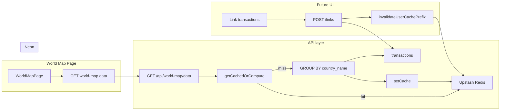

# World Map Database Integration Plan (No New Tables)

## Current state

- **Database (Neon, project Trakzi)**: [transactions] has `id`, `user_id`, `tx_date`, `description`, `amount`, `category_id`, etc. No country/location column. All app APIs scope by `user_id` via `getCurrentUserId()` from [lib/auth.ts](lib/auth.ts).
- **World map page**: [WorldMapPage.tsx](app/world-map/_page/WorldMapPage.tsx) uses hardcoded `SAMPLE_COUNTRY_DATA` (`CountryData[]`: `id` = country name, `value` = spend). [WorldMapChart.tsx](app/world-map/_page/components/WorldMapChart.tsx) expects `data` with `id` matching GeoJSON `properties.name` (e.g. `"USA"`, `"France"`, `"UK"` from [world-countries.json](lib/data/world-countries.json)).
- **No new components or buttons** — this plan is data/API only; UI for "add country" and "link transactions" is out of scope.

---

## 1. Schema change: one column on `transactions`

**Add to existing `transactions` table:**


| Column         | Type | Notes                                                                              |
| -------------- | ---- | ---------------------------------------------------------------------------------- |
| `country_name` | text | NULLable. Must match GeoJSON `properties.name` (e.g. `"USA"`, `"France"`, `"UK"`). |


- **Migration**: `ALTER TABLE transactions ADD COLUMN country_name text NULL;`
- **Optional index** (for fast aggregation by country): `CREATE INDEX idx_transactions_user_country ON transactions (user_id, country_name) WHERE country_name IS NOT NULL;` (partial index keeps it small).

No new tables. All "visited countries" and "links" are represented by this column.

---

## 2. Saving countries the user visits

**No separate storage.** The list of countries the user has "visited" (or added) is derived from transactions that have a country set:

```sql
SELECT DISTINCT country_name
FROM transactions
WHERE user_id = $1 AND country_name IS NOT NULL
ORDER BY country_name;
```

A country appears in the list as soon as at least one transaction is linked to it. Countries = distinct `country_name` from transactions.

---

## 3. Linking transactions to a country and total spent per country

**Linking (future UI):** Set `country_name` on the chosen transactions. Only allow updates for the current user's transactions:

```sql
UPDATE transactions
SET country_name = $1, updated_at = now()
WHERE id = ANY($2) AND user_id = $3;
```

- **Payload**: `{ country_name: string, transaction_ids: number[] }`. Validate that each `transaction_id` belongs to the current user (e.g. by checking row count or doing a prior SELECT).

**Unlinking:** Set `country_name` back to NULL for the given transaction(s) and user.

**Total spent per country (for map and stats):**

- **Definition of "spent"**: Same as analytics — expenses are negative `amount`. Total spent in a country = sum of **absolute values** of `amount` where `amount < 0` and `country_name` is set.
- **Query** (single aggregation, no N+1):

```sql
SELECT country_name AS id, COALESCE(SUM(ABS(amount)), 0) AS value
FROM transactions
WHERE user_id = $1 AND country_name IS NOT NULL AND amount < 0
GROUP BY country_name;
```

Result shape maps directly to `CountryData[]`: `id` = country name, `value` = total spent. Stats (countries count, top country, total abroad, domestic) are derived from this list plus a configured "domestic" country name (e.g. `"USA"`).

---

## 4. Safe, lightweight, and scalable

**Safety**

- Every API uses `getCurrentUserId()` and filters by `user_id`. No cross-user access.
- Link/update API only updates rows where `user_id` = current user; validate `transaction_ids` ownership (e.g. ensure updated row count matches request length or run a pre-check SELECT).

**Lightweight**

- **No new tables** — one nullable column on `transactions`. Optional partial index keeps aggregation cheap without indexing every row.
- **Single read query** for the map: one GROUP BY over `transactions` returns all countries and totals for the current user.

**Scalable (hundreds to thousands of users)**

- The aggregation query is a simple GROUP BY on an indexed column; Postgres handles this at the described scale. The world-map data response is cached per user in Redis (Upstash) with 5-minute TTL and invalidated on link/unlink (section 6).

---

## 5. Implementation outline (no new UI)

**Schema (Neon migration)**

1. Add `country_name text NULL` to `transactions`.
2. Optionally add partial index: `CREATE INDEX idx_transactions_user_country ON transactions (user_id, country_name) WHERE country_name IS NOT NULL;`

**API routes (all scoped by current user)**

1. **Countries list** (for future "add country" or dropdowns)
  - `GET /api/world-map/countries` — `SELECT DISTINCT country_name FROM transactions WHERE user_id = $1 AND country_name IS NOT NULL ORDER BY country_name`.
2. **Link / unlink transactions**
  - `POST /api/world-map/links` — body `{ country_name: string, transaction_ids: number[] }`. Validate ownership; run `UPDATE transactions SET country_name = $1, updated_at = now() WHERE id = ANY($2) AND user_id = $3`. After success, call `invalidateUserCachePrefix(userId, 'world-map')` (see section 6).
  - `DELETE /api/world-map/links` or PATCH — body e.g. `{ transaction_ids: number[] }` to set `country_name = NULL, updated_at = now()` for those transactions (and user_id = current user). After success, call `invalidateUserCachePrefix(userId, 'world-map')`.
3. **World map data (replace SAMPLE_COUNTRY_DATA)**
  - `GET /api/world-map/data` (or `GET /api/charts/world-map-bundle`) — run the aggregation SQL above; return JSON array `{ id: country_name, value: total_spent }` plus optional stats (countries count, top country, total abroad, domestic). Same shape as current `CountryData[]`. **Cache:** use Redis (Upstash) via `getCachedOrCompute` with key `buildCacheKey('world-map', userId, null, 'bundle')` and TTL 5 min; see section 6.

**App wiring (no new components/buttons)**

- In [WorldMapPage.tsx](app/world-map/_page/WorldMapPage.tsx) (or a small data hook): replace `SAMPLE_COUNTRY_DATA` with a fetch to the world-map data API; derive stats from that response. Map and stats components stay unchanged.
- Future "add country" and "link transactions" UI call the POST/DELETE endpoints above; no further schema changes.

---

## 6. Caching (Redis / Upstash)

Bundle the world-map API response and cache it in Redis (Upstash) using the same pattern as the analytics bundle ([lib/cache/upstash.ts](lib/cache/upstash.ts), [app/api/charts/analytics-bundle/route.ts](app/api/charts/analytics-bundle/route.ts)).

**Cache config**

- **Prefix:** Add `world-map` to `CACHE_PREFIX` in [lib/cache/upstash.ts](lib/cache/upstash.ts) (e.g. `'world-map': 'world-map'`).
- **TTL:** Use the same TTL as analytics (5 minutes), e.g. `CACHE_TTL.analytics`, or add `world-map: 5 * 60` to `CACHE_TTL` if you want a dedicated value.
- **Key:** User-scoped, no filter (world-map data is all-time per user). Build with `buildCacheKey('world-map', userId, null, 'bundle')` → e.g. `user:{userId}:world-map:bundle`.

**GET /api/world-map/data (or world-map-bundle)**

- Use `getCachedOrCompute<T>(cacheKey, computeFn, ttlSeconds)`:
  - `cacheKey = buildCacheKey('world-map', userId, null, 'bundle')`.
  - `computeFn` = run the aggregation SQL and build the response (country data array + optional stats).
  - `ttlSeconds = CACHE_TTL.analytics` (5 minutes).
- Return the same JSON as today; add response headers for consistency and debugging:
  - `Cache-Control: no-store, no-cache, must-revalidate, private` (do not let edge/CDN cache; Redis is the cache).
  - `X-Cache-Key: <cacheKey>` (optional, for debugging).

**Invalidation**

- **POST /api/world-map/links** (link transactions to a country): after a successful `UPDATE transactions SET country_name = ...`, call `invalidateUserCachePrefix(userId, 'world-map')` so the next GET returns fresh data.
- **DELETE /api/world-map/links** (or PATCH unlink): after a successful `UPDATE transactions SET country_name = NULL ...`, call `invalidateUserCachePrefix(userId, 'world-map')`.
- **Optional:** When transactions are deleted elsewhere (e.g. statement delete), invalidate world-map for that user if the app already has a hook there (e.g. `invalidateUserCachePrefix(userId, 'world-map')` alongside analytics invalidation). Otherwise rely on TTL (5 minutes).

**Behavior**

- If Redis is not configured (`UPSTASH_REDIS_REST_URL` / `UPSTASH_REDIS_REST_TOKEN` missing), `getCachedOrCompute` skips cache and runs `computeFn` only (same as analytics bundle).
- Cached value = full API response (e.g. `{ data: CountryData[], stats?: { ... } }` or whatever shape the route returns), so one cache entry per user, no per-country keys.

---

## Data flow summary




- **Today**: Page calls `GET /api/world-map/data` → one query on `transactions` (GROUP BY country_name) → returns `CountryData[]`; page uses it for map and stats. With no `country_name` set yet, result is empty (or return a default domestic-only row from config if desired).
- **Later**: "Link transactions to country" calls POST `/api/world-map/links` (UPDATE transactions SET country_name); next load gets updated data from the same GET. Countries list is derived from distinct `country_name` (no separate "add country" table).

---

## Final review

**Verdict:** The implementation is sound and appropriate for the goals (no new tables, minimal schema change, safe and scalable). One fix and a few optional refinements are worth applying.

**Fix (apply when implementing)**

- **Unlink:** When setting `country_name = NULL`, also set `updated_at = now()` so the row stays consistent with the schema (`updated_at` is NOT NULL). Use: `UPDATE transactions SET country_name = NULL, updated_at = now() WHERE id = ANY($1) AND user_id = $2`.

**Optional refinements**

1. **Country name validation:** Validate or normalize `country_name` against the GeoJSON list (e.g. from [world-countries.json](lib/data/world-countries.json)) so stored names match map keys exactly (e.g. `"USA"` not `"usa"`). Reject or normalize before UPDATE.
2. **Countries with zero spend:** The current aggregation only returns countries that have at least one expense (`amount < 0`). Countries where the user linked only income will appear in `GET /api/world-map/countries` but not in map data. If you want every "visited" country to appear on the map (with value 0 when no expenses), use a query that left-joins distinct countries to the sum (e.g. `FROM (SELECT DISTINCT country_name FROM transactions WHERE user_id = $1 AND country_name IS NOT NULL) c LEFT JOIN (SELECT country_name, SUM(ABS(amount)) AS value FROM transactions WHERE user_id = $1 AND country_name IS NOT NULL AND amount < 0 GROUP BY country_name) s ON c.country_name = s.country_name`). Otherwise keep current behavior: map shows only countries with at least one expense.
3. **Empty or invalid payloads:** Reject `POST /api/world-map/links` when `transaction_ids` is empty or when the UPDATE affects fewer rows than the length of `transaction_ids` (ownership check).

**Consistency with codebase**

- Auth: Use `getCurrentUserId()` and scope all queries by `user_id` (same as [app/api/transactions/route.ts](app/api/transactions/route.ts) and other APIs).
- Cache: World-map data is bundled and cached in Redis (Upstash) per section 6; invalidate on link/unlink via `invalidateUserCachePrefix(userId, 'world-map')`.
- `transactions.updated_at` is NOT NULL in the schema; the plan already sets it on link; ensure unlink sets it as in the fix above.

