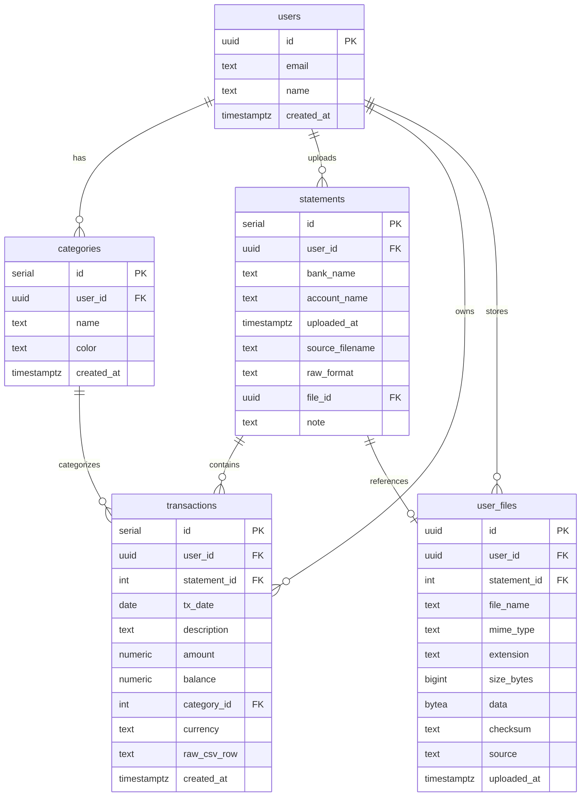

# Backend Documentation

## Overview

This backend implements a file upload, parsing, and transaction import system for bank statements. It supports PDF, Excel (.xls/.xlsx), and CSV formats with AI-powered transaction categorization using OpenAI.

---

## Database Schema

The system uses **Neon Postgres** with 5 core tables:

### Entity Relationship Diagram



### Table Details

#### `users`
- Stores user account information
- Uses UUID for cross-platform compatibility
- Email should be unique

#### `categories`
- User-specific transaction categories
- Each user can define custom categories
- Unique constraint on `(user_id, name)`

#### `statements`
- One record per bank statement upload
- Links to original file via `file_id`
- Tracks format: `pdf`, `csv`, `xlsx`, `xls`, `other`

#### `transactions`
- Individual transaction records
- Always linked to a `statement_id`
- Optionally linked to `category_id` for categorization
- `raw_csv_row` stores original parsed data as JSON

#### `user_files`
- Stores raw file content as `bytea`
- Supports any file type/format
- SHA256 checksum for integrity verification
- Can be linked to statements or standalone

### Indices

```sql
CREATE INDEX idx_transactions_user_date ON transactions (user_id, tx_date);
CREATE INDEX idx_transactions_user_category ON transactions (user_id, category_id);
CREATE INDEX idx_user_files_user ON user_files (user_id, uploaded_at DESC);
```

---

## API Endpoints

### 1. `POST /api/files/upload`

**Purpose:** General-purpose file upload endpoint

**Request:**
```http
POST /api/files/upload
Content-Type: multipart/form-data

file: <File>
```

**Response:**
```json
{
  "fileId": "uuid-here",
  "stored": {
    "id": "uuid-here",
    "user_id": "user-uuid",
    "file_name": "document.pdf",
    "size_bytes": 123456,
    "uploaded_at": "2025-11-22T20:45:00Z"
  }
}
```

**Use Case:** Upload any file for storage (non-bank documents, images, etc.)

---

### 2. `POST /api/statements/parse`

**Purpose:** Parse bank statement file and return categorized CSV

**Request:**
```http
POST /api/statements/parse
Content-Type: multipart/form-data

file: <File>
bankName: "Santander" (optional)
```

**Response (Success - Parseable):**
```csv
date,description,amount,balance,category
2025-10-30,SUPERMARKET PURCHASE,-45.20,1234.56,Groceries
2025-10-29,SALARY DEPOSIT,2500.00,1279.76,Salary / Income
```

**Headers:**
```
Content-Type: text/csv
X-File-Id: uuid-of-stored-file
```

**Response (Not Parseable):**
```json
{
  "fileId": "uuid-here",
  "parseable": false,
  "message": "File stored but not parsed (extension: docx)"
}
```

**Supported Formats:**
- `.pdf` - Santander-style bank statements
- `.csv` - Standard bank CSV exports
- `.xls`, `.xlsx` - Excel bank statements

**Processing Steps:**
1. Save file to `user_files` table
2. Detect file extension
3. Route to appropriate parser (PDF/Excel/CSV)
4. Normalize rows to `TxRow` format
5. AI categorization via OpenAI
6. Return canonical CSV

---

### 3. `POST /api/statements/import`

**Purpose:** Import reviewed CSV into database

**Request:**
```json
{
  "csv": "date,description,amount,balance,category\n2025-10-30,Purchase,-45.20,1234.56,Groceries",
  "statementMeta": {
    "bankName": "Santander",
    "sourceFilename": "statement_oct.pdf",
    "rawFormat": "pdf",
    "fileId": "uuid-from-parse-step"
  }
}
```

**Response:**
```json
{
  "statementId": 42,
  "inserted": 127
}
```

**Processing Steps:**
1. Parse CSV into `TxRow[]` array
2. Create `statements` record
3. Bulk insert `transactions` records
4. Link to original file via `fileId`

---

## File Parsing Flow

### PDF Parsing (`parsePdfToRows.ts`)

**Library:** `pdf-parse`

**Process:**
1. Extract text from PDF
2. Find transaction table header (contains "transaction date", "amount", "balance")
3. Pattern match transaction blocks:
   - Date line: `30 oct 2025`
   - Description lines (multi-line)
   - Amount + Balance line: `-45,20€  1.234,56€`
4. Parse Euro amounts (handle `.` thousand separator, `,` decimal)
5. Convert Spanish dates to ISO format

**Output:** `TxRow[]`

---

### Excel Parsing (`parseExcelToRows.ts`)

**Library:** `xlsx` (SheetJS)

**Process:**
1. Read first sheet from workbook
2. Convert to JSON with headers
3. Auto-detect columns (case-insensitive):
   - Date → `date`, `Date`, `DATE`
   - Description → `description`, `Description`, `DESCRIPTION`
   - Amount → `amount`, `Amount`, `AMOUNT`
   - Balance → `balance`, `Balance`, `BALANCE`
4. Handle Excel serial dates
5. Normalize to `TxRow[]`

---

### CSV Parsing (`parseCsvToRows.ts`)

**Library:** `papaparse`

**Process:**
1. Parse CSV with headers
2. Skip empty lines
3. Map columns (case-insensitive)
4. Coerce types (string dates, number amounts)
5. Return `TxRow[]`

---

## AI Categorization

**Library:** OpenAI API (`gpt-4.1-mini`)

**Categories:**
- Groceries
- Restaurants & Bars
- Shopping
- Transport
- Utilities & Internet
- Insurance
- Taxes & Fees
- Salary / Income
- Transfers / Family
- Savings
- Other

**Process:**
1. Build compact payload: `[{ index, description, amount }, ...]`
2. Send to OpenAI with system prompt defining categories
3. Receive JSON: `[{ index: 0, category: "Groceries" }, ...]`
4. Map categories back to rows
5. Fallback to "Other" on errors

**API Call:**
```typescript
fetch("https://api.openai.com/v1/chat/completions", {
  method: "POST",
  headers: {
    Authorization: `Bearer ${OPENAI_API_KEY}`
  },
  body: JSON.stringify({
    model: "gpt-4.1-mini",
    messages: [
      { role: "system", content: systemPrompt },
      { role: "user", content: JSON.stringify(items) }
    ],
    response_format: { type: "json_object" }
  })
})
```

---

## Environment Variables

### Required

```bash
# Neon Database
NEON_REST_URL=https://ep-winter-morning-abr3z6hn.apirest.eu-west-2.aws.neon.tech/neondb/rest/v1
NEON_API_KEY=your-neon-api-key-here

# OpenAI
OPENAI_API_KEY=sk-proj-...
```

### Setup

1. Create `.env.local` in project root
2. Add all required variables
3. Restart Next.js dev server: `npm run dev`

---

## Authentication (Neon)

### Overview

This implementation uses **Neon's Data API authentication** with JWT tokens.

### How It Works

1. **JWT Token:** The `NEON_API_KEY` acts as a JWT token
2. **User ID Extraction:** Neon's `auth.user_id()` SQL function extracts the user ID from the JWT
3. **Row-Level Security:** Use `auth.user_id()` in RLS policies for multi-tenant data isolation

### Implementation (`lib/auth.ts`)

```typescript
export async function getCurrentUserId(): Promise<string> {
  // In production, extract from JWT token sent with request
  // For MVP, Neon API key includes user identity
  // This can be enhanced with proper JWT parsing
  return "user-uuid-from-jwt";
}
```

### Future Enhancement

For production multi-tenant systems:
1. Implement Row-Level Security policies
2. Use Neon Authorize or custom JWT validation
3. Extract `user_id` from JWT claims in middleware

---

## Example Workflows

### Workflow 1: Upload PDF Statement

```bash
# 1. Upload & Parse
curl -X POST http://localhost:3000/api/statements/parse \
  -F "file=@santander_oct_2025.pdf" \
  -F "bankName=Santander" \
  > statement.csv

# Extract file ID from headers
FILE_ID=$(curl -I http://localhost:3000/api/statements/parse -F "file=@santander_oct_2025.pdf" | grep X-File-Id)

# 2. Review CSV (user can edit in spreadsheet)
# Edit statement.csv as needed

# 3. Import to Database
curl -X POST http://localhost:3000/api/statements/import \
  -H "Content-Type: application/json" \
  -d '{
    "csv": "..."  # paste CSV content here
    "statementMeta": {
      "bankName": "Santander",
      "sourceFilename": "santander_oct_2025.pdf",
      "rawFormat": "pdf",
      "fileId": "'$FILE_ID'"
    }
  }'
```

### Workflow 2: Upload Excel Statement

```typescript
// Frontend code
const formData = new FormData();
formData.append('file', excelFile);
formData.append('bankName', 'Bank Name');

// Step 1: Parse
const res = await fetch('/api/statements/parse', {
  method: 'POST',
  body: formData
});

const csv = await res.text();
const fileId = res.headers.get('X-File-Id');

// Step 2: User edits CSV in UI (optional)
// ...edited CSV...

// Step 3: Import
await fetch('/api/statements/import', {
  method: 'POST',
  headers: { 'Content-Type': 'application/json' },
  body: JSON.stringify({
    csv: editedCsv,
    statementMeta: {
      bankName: 'Bank Name',
      sourceFilename: excelFile.name,
      rawFormat: 'xlsx',
      fileId
    }
  })
});
```

---

## File Structure

```
folio2/
├── app/
│   └── api/
│       ├── files/
│       │   └── upload/
│       │       └── route.ts          # General file upload
│       └── statements/
│           ├── parse/
│           │   └── route.ts          # Parse & categorize
│           └── import/
│               └── route.ts          # Import to DB
├── lib/
│   ├── types/
│   │   └── transactions.ts           # TxRow type
│   ├── neonClient.ts                 # Neon REST API wrapper
│   ├── auth.ts                       # JWT user ID extraction
│   ├── files/
│   │   └── saveFileToNeon.ts         # File storage utility
│   ├── parsing/
│   │   ├── parsePdfToRows.ts         # PDF parser
│   │   ├── parseExcelToRows.ts       # Excel parser
│   │   ├── parseCsvToRows.ts         # CSV parser
│   │   └── rowsToCanonicalCsv.ts     # CSV formatter
│   └── ai/
│       └── categoriseTransactions.ts # OpenAI integration
└── backend/
    └── README.md                      # This file
```

---

## Next Steps

1. **Install Dependencies:**
   ```bash
   npm install pdf-parse xlsx papaparse
   npm install --save-dev @types/pdf-parse @types/papaparse
   ```

2. **Set Up Database:**
   - Run SQL schema in Neon SQL Editor
   - Create test user and note UUID

3. **Configure Environment:**
   - Add all required env variables to `.env.local`

4. **Test Endpoints:**
   - Test file upload → parse → import workflow
   - Verify data in Neon tables

5. **Connect Frontend:**
   - Build upload UI with file picker
   - CSV preview/edit component
   - Import confirmation flow
