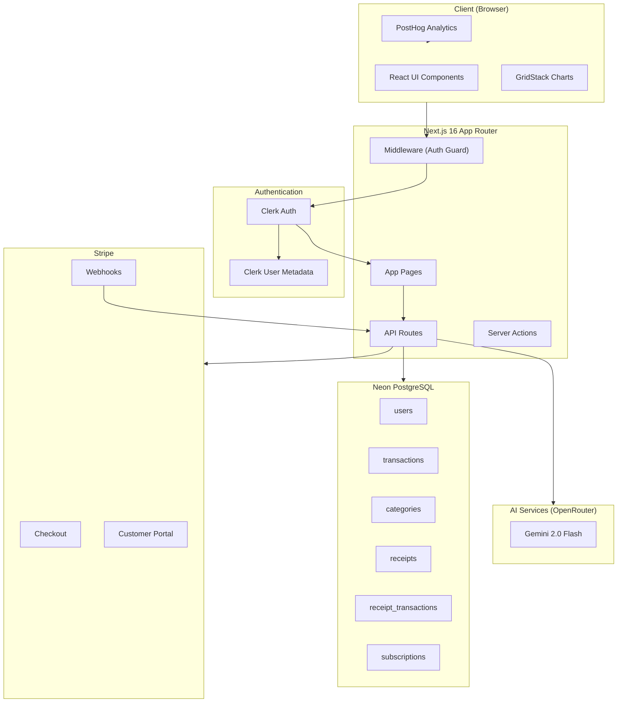
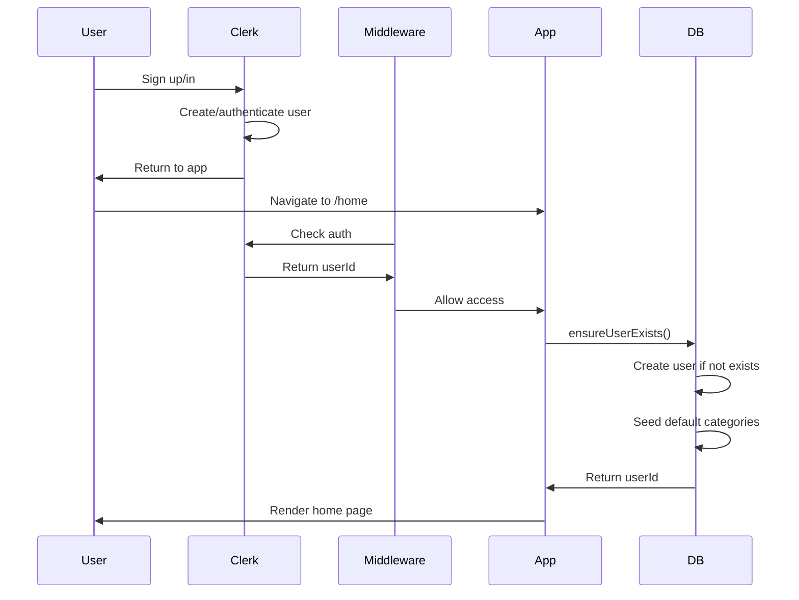
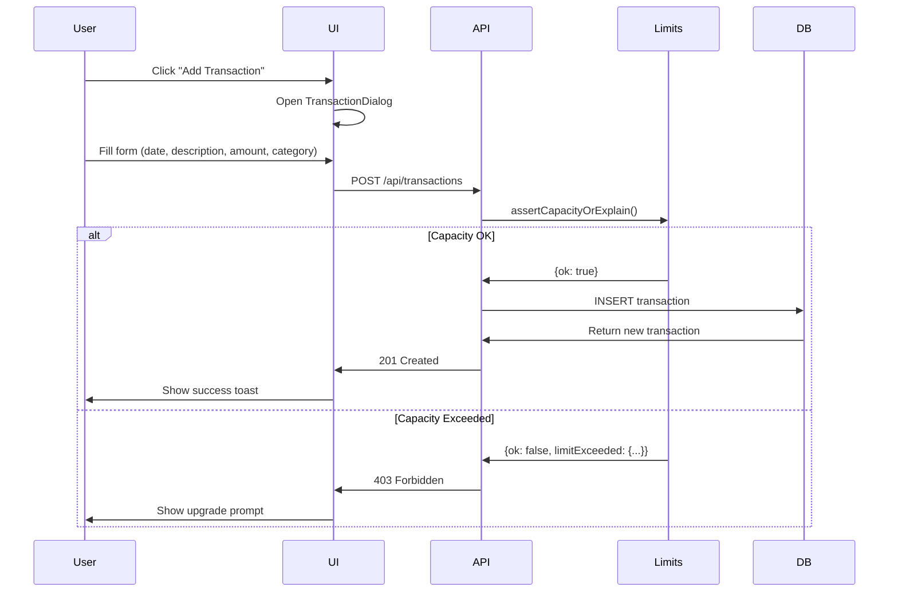
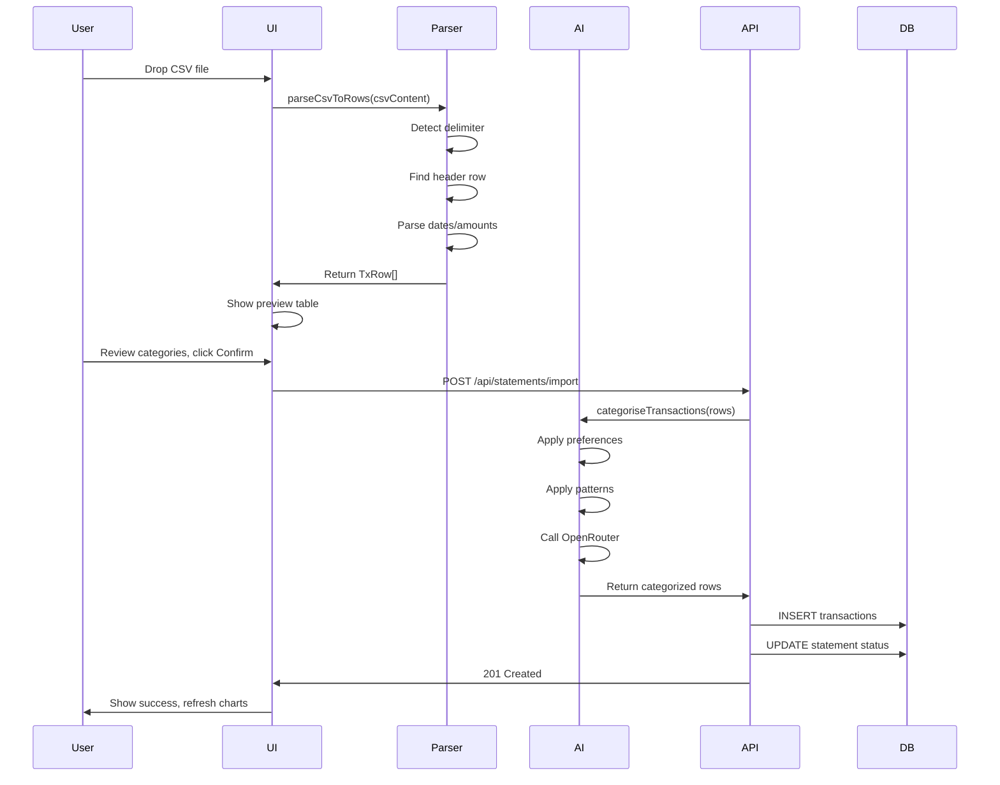
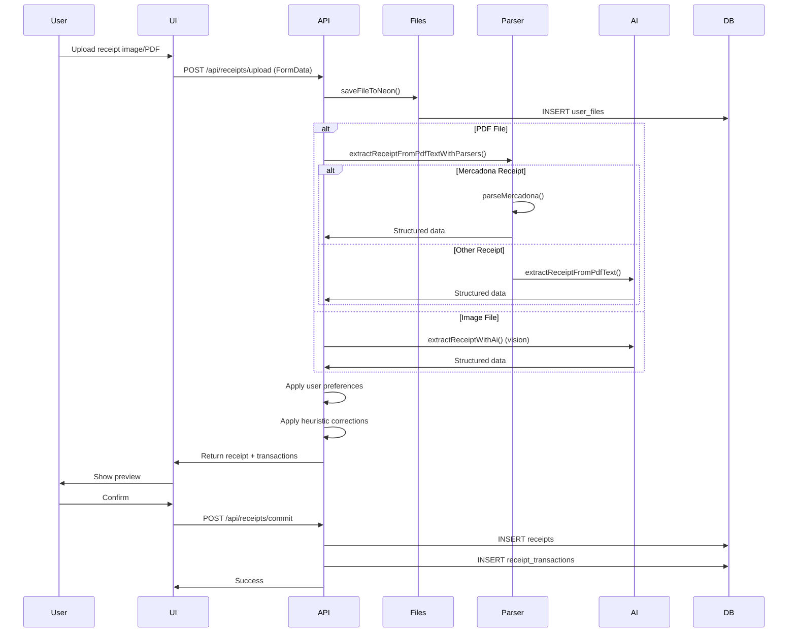
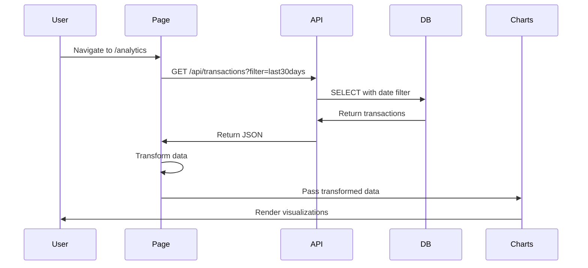
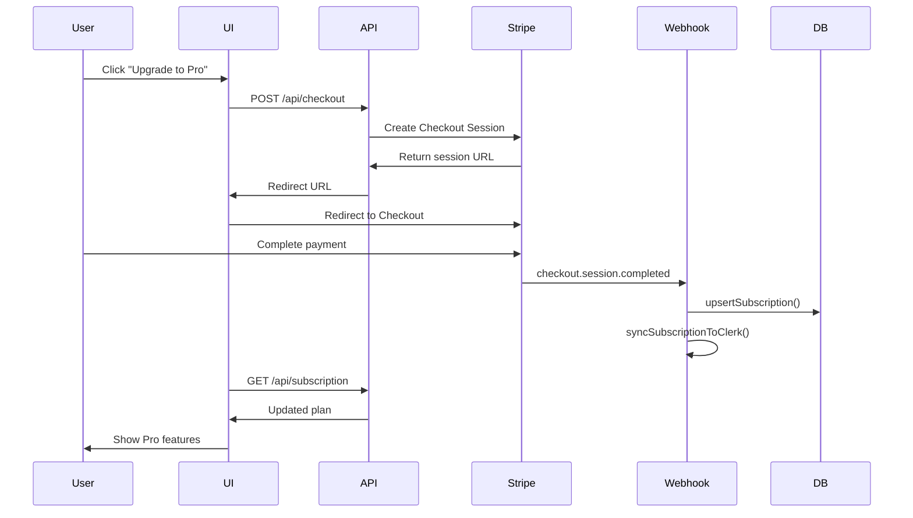

# Trakzi (Folio) - Complete Project Deep Dive Documentation

> **Generated:** December 23, 2024  
> **Repository:** https://github.com/yares28/Folio

---

## Table of Contents

1. [Project Overview](#project-overview)
2. [Feature List](#feature-list)
3. [Architecture Overview](#architecture-overview)
4. [Technology Stack](#technology-stack)
5. [Data Entities](#data-entities)
6. [Folder Structure](#folder-structure)
7. [File-by-File Deep Dive](#file-by-file-deep-dive)
   - [Root Configuration Files](#root-configuration-files)
   - [App Directory](#app-directory)
   - [Lib Directory](#lib-directory)
   - [Components Directory](#components-directory)
   - [Database Directory](#database-directory)
   - [Tests Directory](#tests-directory)
   - [Scripts Directory](#scripts-directory)
8. [End-to-End Feature Flows](#end-to-end-feature-flows)
9. [Environment Variables and Configuration](#environment-variables-and-configuration)
10. [Security, Privacy, and Compliance Notes](#security-privacy-and-compliance-notes)
11. [Performance and Reliability](#performance-and-reliability)
12. [Known Gaps / TODOs](#known-gaps--todos)

---

## Project Overview

**Trakzi** is a personal finance management web application that helps users track income, expenses, savings, and overall financial health. It offers:

- **Bank statement import** via CSV file upload with AI-powered transaction categorization
- **Receipt scanning** using OCR/AI extraction to parse grocery receipts (images and PDFs)
- **"Fridge" feature** for tracking grocery purchases by food category and macronutrient type
- **Interactive analytics dashboards** with 30+ chart types built using Recharts, Nivo, and custom visualizations
- **AI chat assistant** for financial insights and questions
- **Subscription management** with tiered plans (Free, Pro, Max) via Stripe

The application uses **Next.js 16 App Router**, **Clerk** for authentication, **Neon PostgreSQL** for the database, **Stripe** for payments, and **OpenRouter** for AI capabilities.

---

## Feature List

### Core Financial Features
- ✅ CSV bank statement import with automatic parsing
- ✅ AI-powered transaction categorization using OpenRouter/Gemini
- ✅ Manual transaction entry
- ✅ 22 default expense/income categories
- ✅ Category-based budgeting

### Receipt & Grocery Tracking ("Fridge")
- ✅ Receipt image upload (PNG, JPEG, WEBP, HEIC)
- ✅ Receipt PDF upload with deterministic parser (Mercadona)
- ✅ AI-powered receipt data extraction (Google Gemini 2.0)
- ✅ 28+ food categories with macronutrient types
- ✅ User preference learning for recurring items

### Analytics & Visualization
- ✅ 30+ chart types (area, pie, radar, sankey, treemap, heatmap, etc.)
- ✅ Interactive chart grid with GridStack drag-and-drop
- ✅ Date range filtering (7d, 30d, 3m, 6m, 1y, yearly)
- ✅ Favorite charts with reordering
- ✅ AI-generated chart insights

### Subscription & Billing
- ✅ Three-tier subscription model (Free, Pro, Max)
- ✅ Stripe Checkout integration
- ✅ Stripe Customer Portal for subscription management
- ✅ Transaction limits per plan
- ✅ Webhook handling for subscription lifecycle

### User Experience
- ✅ Dark/light theme support
- ✅ Mobile-responsive design
- ✅ Currency formatting
- ✅ PostHog analytics integration
- ✅ Bug report dialog

---

## Architecture Overview



### Data Flow Summary

1. **User signs up/in** → Clerk authenticates → User synced to Neon `users` table
2. **Import CSV** → Parse rows → AI categorizes → Insert to `transactions`
3. **Upload receipt** → Store in `user_files` → AI extracts items → Insert to `receipt_transactions`
4. **Subscribe** → Stripe Checkout → Webhook → Update `subscriptions` table
5. **View charts** → API fetches transactions → Transform data → Render charts

---

## Technology Stack

| Layer | Technology |
|-------|------------|
| **Framework** | Next.js 16 (App Router) |
| **Language** | TypeScript 5 |
| **Styling** | Tailwind CSS 4 |
| **UI Components** | Radix UI, shadcn/ui |
| **Charts** | Recharts, Nivo, ECharts |
| **Drag & Drop** | GridStack, @dnd-kit |
| **Authentication** | Clerk |
| **Database** | Neon PostgreSQL (serverless) |
| **ORM** | Direct SQL via @neondatabase/serverless |
| **Payments** | Stripe |
| **AI/LLM** | OpenRouter (Gemini) |
| **Analytics** | PostHog, Vercel Analytics |
| **Animations** | Framer Motion |
| **Testing** | Jest, Playwright |
| **Deployment** | Vercel |

---

## Data Entities

### Database Schema (Neon PostgreSQL)

```mermaid
erDiagram
    users ||--o{ transactions : has
    users ||--o{ categories : has
    users ||--o{ statements : has
    users ||--o{ receipts : has
    users ||--o{ receipt_categories : has
    users ||--o{ receipt_category_types : has
    users ||--o{ subscriptions : has
    users ||--o{ user_files : has
    
    statements ||--o{ transactions : contains
    categories ||--o{ transactions : categorizes
    
    receipts ||--o{ receipt_transactions : contains
    receipt_categories ||--o{ receipt_transactions : categorizes
    receipt_category_types ||--o{ receipt_categories : types
    
    user_files ||--o{ receipts : stores

    users {
        text id PK "Clerk user ID"
        text email UK
        text name
        timestamptz created_at
        timestamptz updated_at
    }
    
    transactions {
        serial id PK
        text user_id FK
        integer statement_id FK
        date tx_date
        time tx_time
        text description
        numeric amount
        numeric balance
        integer category_id FK
        text currency
        jsonb raw_csv_row
    }
    
    categories {
        serial id PK
        text user_id FK
        text name UK
        text color
        text icon
        boolean is_default
    }
    
    receipts {
        text id PK
        text user_id FK
        text receipt_file_id FK
        text store_name
        date receipt_date
        time receipt_time
        numeric total_amount
        text currency
        text status
        jsonb ai_extraction_data
    }
    
    receipt_transactions {
        serial id PK
        text receipt_id FK
        text user_id FK
        text description
        numeric quantity
        numeric price_per_unit
        numeric total_price
        integer category_id FK
        date receipt_date
        time receipt_time
    }
    
    subscriptions {
        text id PK
        text user_id FK UK
        text plan
        text status
        text stripe_customer_id UK
        text stripe_subscription_id UK
        text stripe_price_id
        timestamptz current_period_end
        boolean cancel_at_period_end
        boolean is_lifetime
        text pending_plan
    }
```

### Key Data Relationships

- **users → transactions**: One user has many bank transactions
- **users → receipts**: One user has many scanned receipts
- **receipts → receipt_transactions**: One receipt has many line items
- **categories → transactions**: Many-to-one (each transaction has one category)
- **receipt_categories → receipt_transactions**: Many-to-one (each item has one food category)
- **users → subscriptions**: One-to-one (each user has one subscription record)

---

## Folder Structure

```
folio2/
├── app/                          # Next.js App Router pages and API routes
│   ├── (landing)/               # Landing page route group (public)
│   ├── analytics/               # Analytics dashboard page
│   ├── api/                     # API routes (53 subdirectories)
│   ├── billing/                 # Billing page
│   ├── chat/                    # AI chat page
│   ├── dashboard/               # User dashboard
│   ├── data-library/            # Data management page
│   ├── fridge/                  # Grocery tracking page
│   ├── home/                    # Main home page (authenticated)
│   ├── reports/                 # Reports page
│   ├── savings/                 # Savings page
│   ├── trends/                  # Trends page
│   ├── layout.tsx               # Root layout with providers
│   ├── globals.css              # Global styles
│   └── middleware.ts            # Auth middleware
├── components/                   # React components (207 files)
│   ├── ai-elements/             # AI-related UI components
│   ├── chat/                    # Chat components
│   ├── dashboard/               # Dashboard-specific components
│   ├── fridge/                  # Fridge page charts and components
│   ├── test-charts/             # Test chart components
│   └── ui/                      # shadcn/ui base components
├── lib/                         # Utility libraries and helpers
│   ├── ai/                      # AI categorization and insights
│   ├── files/                   # File storage utilities
│   ├── limits/                  # Subscription limit enforcement
│   ├── parsing/                 # CSV parsing utilities
│   ├── receipts/                # Receipt processing and parsers
│   ├── transactions/            # Transaction preferences
│   └── types/                   # TypeScript type definitions
├── database/                    # Database schema
│   └── schema.sql               # Complete SQL schema
├── prisma/                      # Prisma configuration (legacy)
│   ├── migrations/              # Database migrations
│   └── schema.prisma            # Prisma schema (unused)
├── hooks/                       # Custom React hooks
├── scripts/                     # Utility scripts
├── __tests__/                   # Test files
├── public/                      # Static assets
└── [config files]               # Various configuration files
```

---

## File-by-File Deep Dive

---

### Root Configuration Files

#### `package.json`

**Purpose**: Defines project dependencies and scripts.

**Key Dependencies**:
- `next@^16.0.8` - Core framework
- `@clerk/nextjs@^6.36.0` - Authentication
- `@neondatabase/serverless@^1.0.2` - Database client
- `stripe@^20.1.0` - Payment processing
- `recharts@2.15.4`, `@nivo/*` - Charting libraries
- `papaparse@^5.5.3` - CSV parsing
- `unpdf@^1.4.0` - PDF text extraction
- `posthog-js@^1.309.1` - Analytics

**Scripts**:
- `dev` - Run development server
- `build` - Build for production
- `start` - Start production server
- `lint` - Run ESLint

---

#### `middleware.ts`

**Purpose**: Clerk authentication middleware that guards protected routes.

**Key Exports**: `default` - Clerk middleware function

**How it works**:
1. Checks `BYPASS_CLERK_AUTH` env var for development bypass
2. Defines public routes (landing, sign-in, sign-up, webhooks, testCharts)
3. Defines protected routes (home, analytics, dashboard, etc.)
4. Redirects authenticated users from sign-in to /home
5. Redirects unauthenticated users from protected routes to sign-in

**Environment Variables**:
- `BYPASS_CLERK_AUTH` - Set to "true" to skip auth in development

**Imported by**: Next.js runtime automatically

---

#### `next.config.ts`

**Purpose**: Next.js configuration.

**Key Configuration**:
- `serverExternalPackages: []` - Empty (no external packages)
- `outputFileTracingRoot` - Silences workspace warnings
- Redirect `/analytics/trends` → `/trends`
- PostHog reverse proxy rewrites (`/ingest/*` → PostHog EU servers)
- `skipTrailingSlashRedirect: true` - Required for PostHog

**Environment Variables**: None directly, but affects how env vars are loaded.

---

#### `instrumentation-client.ts`

**Purpose**: Initializes PostHog analytics client-side.

**How it works**:
1. Only runs in browser (`typeof window !== 'undefined'`)
2. Checks for `NEXT_PUBLIC_POSTHOG_KEY`
3. Initializes PostHog with EU endpoint via `/ingest` proxy
4. Enables exception capture, disables autocapture in dev

**Environment Variables**:
- `NEXT_PUBLIC_POSTHOG_KEY` - PostHog project API key
- `NEXT_PUBLIC_POSTHOG_HOST` - PostHog UI host

---

### App Directory

#### `app/layout.tsx`

**Purpose**: Root layout wrapping all pages with providers.

**Provider Stack** (outer to inner):
1. `ClerkProvider` - Authentication context
2. `ThemeProvider` - Dark/light theme
3. `ColorSchemeProvider` - Chart color schemes
4. `CurrencyProvider` - Currency formatting
5. `FavoritesProvider` - Favorite charts
6. `DateFilterProvider` - Date range filtering
7. `TransactionDialogProvider` - Transaction edit modal

**Key Exports**: `RootLayout` component, `metadata` (SEO)

**Children Components**:
- `PostHogUserIdentifier` - Links PostHog to Clerk user
- `Toaster` - Sonner toast notifications
- `Analytics` - Vercel Analytics

---

#### `app/globals.css`

**Purpose**: Global styles using Tailwind CSS 4.

**Contents**:
- Tailwind directives
- CSS custom properties for theming
- Dark mode variables
- Custom utility classes

---

#### `app/home/page.tsx`

**Purpose**: Main authenticated home page with charts and file upload.

**Size**: ~3,262 lines (largest page in the app)

**Key Features**:
- Transaction overview charts (income/expense tracking)
- Category spending breakdown
- Spending activity rings
- File upload dialog for CSV/receipts
- GridStack-based chart layout
- Favorite charts management

**Key Components**:
- `SpendingActivityRings` - Custom SVG concentric rings
- `MemoizedTableRow` - Optimized table rows for file preview

**Data Flow**:
1. Fetches `/api/transactions` on load
2. Transforms data for various chart types
3. Stores chart layout in localStorage
4. Uploads files via `/api/statements/import` or `/api/receipts/upload`

**Imports**: 40+ components and utilities

---

#### `app/analytics/page.tsx`

**Purpose**: Advanced analytics dashboard with 30+ chart types.

**Key Features**:
- Full chart showcase with filtering
- Category trend analysis
- Spending patterns by day/week/month
- Budget vs actual comparisons

---

#### `app/fridge/page.tsx`

**Purpose**: Grocery tracking ("Fridge") feature.

**Key Features**:
- Receipt-based item tracking
- Food category breakdown by macronutrient
- Store analysis
- Price comparison over time

---

#### `app/chat/page.tsx`

**Purpose**: AI financial assistant chat interface.

**Key Features**:
- Conversational financial advice
- Context-aware based on user's transaction history
- Streaming responses

---

#### `app/(landing)/page.tsx`

**Purpose**: Public landing page.

**Key Sections**:
- Hero section with animations
- Features showcase
- Pricing section
- FAQ
- Testimonials

---

### API Routes - Detailed Breakdown

#### `app/api/transactions/route.ts`

**Purpose**: CRUD operations for bank transactions.

**Endpoints**:
- `GET` - Fetch transactions with optional date/category filters
- `POST` - Create new transaction

**Key Functions**:
- `getDateRange(filter)` - Converts filter strings to date ranges
- Transaction capacity check before insert

**Data Flow (GET)**:
1. Get user ID from Clerk
2. Parse filter params
3. Build SQL query with date range
4. Join with categories table
5. Format dates as YYYY-MM-DD

**Data Flow (POST)**:
1. Authenticate user
2. Validate required fields
3. Check transaction capacity (plan limits)
4. Insert transaction
5. Return created transaction

**Imported by**: All pages displaying transactions

---

#### `app/api/webhook/stripe/route.ts`

**Purpose**: Handle Stripe webhook events for subscription lifecycle.

**Handled Events**:
- `checkout.session.completed` - New subscription created
- `customer.subscription.created/updated` - Plan changes
- `customer.subscription.deleted` - Cancellation
- `invoice.payment_failed` - Payment failures
- `charge.refunded` - Refunds with auto-cancellation

**Key Functions**:
- `handleCheckoutCompleted` - Creates subscription record
- `handleSubscriptionUpdate` - Updates plan, handles downgrades
- `handleSubscriptionDeleted` - Cancels and downgrades to free
- `handlePaymentFailed` - Marks subscription as past_due
- `handleChargeRefunded` - Full refund triggers cancellation
- `syncSubscriptionToClerk` - Updates Clerk user metadata

**Security**:
- Verifies Stripe webhook signature
- Uses `STRIPE_WEBHOOK_SECRET` env var

**Side Effects**:
- Updates `subscriptions` table
- Updates Clerk user metadata
- Enforces transaction cap on downgrades

---

#### `app/api/receipts/upload/route.ts`

**Purpose**: Handle receipt image/PDF uploads with AI extraction.

**Size**: 783 lines

**Flow**:
1. Validate file type (image or PDF)
2. Store file in `user_files` table
3. For PDFs: Try vision API first, fallback to text extraction
4. For images: Send to AI vision endpoint
5. Parse AI response (with JSON repair if needed)
6. Apply user category preferences
7. Return structured receipt data

**Key Functions**:
- `extractReceiptWithAi` - Vision-based extraction
- `extractReceiptFromPdfText` - Text-based extraction
- `repairReceiptJsonWithAi` - Fix malformed JSON responses
- `tryParseReceiptJson` - Multiple JSON parsing strategies

**AI Model**: `google/gemini-2.0-flash-001` via OpenRouter

---

#### `app/api/billing/*`

**Purpose**: Stripe billing operations.

| Route | Purpose |
|-------|---------|
| `/billing/cancel` | Cancel at period end |
| `/billing/cancel-now` | Immediate cancellation |
| `/billing/change-plan` | Upgrade/downgrade plan |
| `/billing/portal` | Redirect to Stripe Portal |
| `/billing/preview-upgrade` | Get prorated amount |
| `/billing/reactivate` | Undo cancellation |

---

#### `app/api/checkout/route.ts`

**Purpose**: Create Stripe Checkout session for new subscriptions.

**Flow**:
1. Get user ID and email from Clerk
2. Look up or create Stripe customer
3. Create Checkout session with price ID
4. Store user ID in session metadata
5. Return checkout URL

---

#### `app/api/subscription/route.ts`

**Purpose**: Get current user's subscription status.

**Returns**:
```typescript
{
  plan: 'free' | 'pro' | 'max',
  status: 'active' | 'canceled' | 'past_due' | 'paused',
  currentPeriodEnd: Date | null,
  cancelAtPeriodEnd: boolean,
  pendingPlan: string | null
}
```

---

#### `app/api/limits/route.ts`

**Purpose**: Get user's current transaction limits and usage.

**Returns**:
```typescript
{
  cap: number,
  used: number,
  remaining: number,
  bankTransactions: number,
  receiptItems: number,
  plan: 'free' | 'pro' | 'max'
}
```

---

#### `app/api/ai/insights/route.ts`

**Purpose**: Generate AI insights for charts.

**Request**:
```typescript
{
  chartId: string,
  chartTitle: string,
  chartDescription: string,
  chartData: object,
  userContext?: { totalIncome, totalExpenses, ... }
}
```

**Response**:
```typescript
{
  insight: string,
  sentiment: 'positive' | 'neutral' | 'negative' | 'warning',
  tips?: string[]
}
```

---

### Lib Directory

#### `lib/neonClient.ts`

**Purpose**: Database client wrapper for Neon PostgreSQL.

**Key Exports**:
- `neonQuery<T>(sql, params)` - Execute parameterized query
- `neonInsert<T>(table, rows, options)` - Insert rows into table

**Features**:
- Automatic connection pooling (via `-pooler` suffix)
- Parameterized queries to prevent SQL injection
- Error logging with query details

**Environment Variables**:
- `DATABASE_URL` or `NEON_CONNECTION_STRING`

**Imported by**: All API routes needing DB access

---

#### `lib/auth-utils.ts`

**Purpose**: Authentication utility functions.

**Key Exports**:
- `withAuth(handler)` - Wrapper for authenticated API routes
- `getUserIdOrNull()` - Get user ID without throwing

**How it works**:
1. Calls Clerk `auth()`
2. Calls `ensureUserExists()` to sync with DB
3. Returns user ID or 401 error

---

#### `lib/user-sync.ts`

**Purpose**: Syncs Clerk users with the database.

**Key Exports**:
- `ensureUserExists()` - Creates user record if not exists
- `getCurrentUserId()` - Alias for ensureUserExists

**Side Effects**:
- Creates user in `users` table
- Seeds default transaction categories
- Seeds default receipt categories

---

#### `lib/subscriptions.ts`

**Purpose**: Subscription management functions.

**Key Exports**:
- `getUserSubscription(userId)` - Get full subscription object
- `getUserPlan(userId)` - Get just the plan type
- `upsertSubscription(params)` - Create or update subscription
- `syncSubscriptionToClerk(...)` - Update Clerk metadata
- `mapStripeStatus(status)` - Convert Stripe status

**Types**:
- `PlanType`: 'free' | 'pro' | 'max'
- `SubscriptionStatus`: 'active' | 'canceled' | 'past_due' | 'paused'

---

#### `lib/stripe.ts`

**Purpose**: Stripe SDK initialization.

**Key Exports**:
- `getStripe()` - Get or create Stripe instance
- `STRIPE_PRICES` - Price ID constants
- `getPlanFromPriceId(priceId)` - Map price to plan

**Environment Variables**:
- `STRIPE_SECRET_KEY`
- `STRIPE_PRICE_ID_PRO_MONTHLY`
- `STRIPE_PRICE_ID_PRO_ANNUAL`
- `STRIPE_PRICE_ID_MAX_MONTHLY`
- `STRIPE_PRICE_ID_MAX_ANNUAL`

---

#### `lib/plan-limits.ts`

**Purpose**: Define plan limits and feature access.

**Key Exports**:
- `PLAN_LIMITS` - Configuration object per plan
- `getPlanLimits(plan)` - Get limits for a plan
- `isFeatureEnabled(plan, feature)` - Check feature access
- `getPlanDisplayName(plan)` - Get human-readable name
- `needsUpgrade(current, required)` - Check if upgrade needed

**Plan Limits**:

| Feature | Free | Pro | Max |
|---------|------|-----|-----|
| Max Transactions | 400 | 3,000 | 15,000 |
| Receipt Scans/Month | ∞ | ∞ | ∞ |
| AI Chat Messages/Day | 5 | ∞ | ∞ |
| AI Insights | ❌ | ✅ | ✅ |
| Export | ❌ | ✅ | ✅ |
| Custom Categories | 10 | ∞ | ∞ |

---

#### `lib/feature-access.ts`

**Purpose**: Check feature access based on subscription.

**Key Exports**:
- `checkFeatureAccess(userId, feature)` - Check if feature allowed
- `checkTotalTransactionLimit(userId)` - Check transaction cap
- `getTotalTransactionUsage(userId)` - Get usage breakdown
- `checkReceiptScanLimit(userId)` - Check monthly scan limit
- `checkAiChatLimit(userId)` - Check daily chat limit
- `checkCustomCategoryLimit(userId)` - Check category limits
- `getUserPlanSummary(userId)` - Full plan + usage summary

---

#### `lib/ai/categoriseTransactions.ts`

**Purpose**: AI-powered transaction categorization.

**Size**: 634 lines

**Key Exports**:
- `categoriseTransactions(rows, customCategories?, options?)` - Categorize transactions

**Categorization Strategy** (priority order):
1. **User preferences** - Previously saved category for description key
2. **Merchant patterns** - Regex patterns for known merchants
3. **AI categorization** - OpenRouter API call for unmatched
4. **Fallback rules** - Pattern + keyword matching

**Known Merchant Patterns** (95+):
- Subscriptions: Netflix, Spotify, Disney+, Amazon Prime
- Groceries: Mercadona, Carrefour, Lidl, Aldi
- Transport: Uber, Cabify, Renfe, Metro
- Restaurants: Glovo, Just Eat, McDonald's

**AI Model**: Configurable via `OPENROUTER_CATEGORY_MODEL` env var

---

#### `lib/ai/chartInsights.ts`

**Purpose**: Generate AI insights for charts.

**Key Exports**:
- `generateChartInsight(request)` - Generate insight for chart data
- `getChartContextHints(chartId)` - Get context hints per chart type

**AI Model**: `google/gemini-2.0-flash-001`

---

#### `lib/receipts/processing.ts`

**Purpose**: Receipt processing pipeline.

**Size**: 720 lines

**Key Exports**:
- `enqueueReceiptProcessing(params)` - Queue async processing
- `processReceiptNow(params)` - Process receipt immediately

**Processing Flow**:
1. Fetch receipt file from `user_files`
2. For PDF: Try deterministic parser, then AI
3. For image: Use AI vision extraction
4. Apply user category preferences
5. Apply heuristic category corrections
6. Insert items into `receipt_transactions`
7. Update receipt status

---

#### `lib/receipts/parsers/`

**Purpose**: Deterministic receipt parsers.

**Files**:
- `index.ts` - Parser dispatcher
- `mercadona.ts` - Mercadona receipt parser
- `types.ts` - Parser type definitions
- `utils.ts` - Parsing utilities

**Mercadona Parser**:
- Extracts store name, date, time
- Parses item lines (description, quantity, price)
- Extracts tax information
- Returns structured data without AI

---

#### `lib/parsing/parseCsvToRows.ts`

**Purpose**: CSV file parsing for bank statements.

**Size**: 759 lines

**Key Exports**:
- `parseCsvToRows(csv, options?)` - Parse CSV to transaction rows

**Features**:
- Automatic delimiter detection (comma, semicolon, tab, pipe)
- Header row detection
- Date normalization (multiple formats)
- Amount parsing (European and US formats)
- Time extraction
- Duplicate detection
- Diagnostic output for debugging

**Supported Date Formats**:
- YYYY-MM-DD
- DD/MM/YYYY
- MM/DD/YYYY
- DD.MM.YYYY
- YYYYMMDD
- Excel serial numbers

---

#### `lib/categories.ts`

**Purpose**: Default transaction category definitions.

**Key Exports**:
- `DEFAULT_CATEGORY_GROUPS` - Categories grouped by type
- `DEFAULT_CATEGORIES` - Flat array of 22 categories

**Category Groups**:
- Food & Drink: Groceries, Restaurants, Bars
- Home & Utilities: Rent, Mortgage, Utilities
- Transportation: Fuel, Transport
- Finance & Insurance: Insurance, Taxes & Fees
- Lifestyle & Shopping: Shopping, Entertainment, Education, etc.
- Income & Transfers: Income, Transfers, Refunds
- Savings & Goals: Savings
- Personal & Other: Other

---

#### `lib/receipt-categories.ts`

**Purpose**: Default food category definitions for Fridge feature.

**Categories** (28 total):
- Protein: Meat, Seafood, Eggs, Legumes
- Carbs: Pasta/Rice/Potato, Bread/Bakery, Snacks, Sweets, Sauce
- Fats: Oils/Fats, Nuts/Seeds, Cheese
- Vitamins/Minerals: Fresh Produce, Frozen Produce, Canned Produce
- Mixed/Other: Dairy, Condiments, Prepared Foods, etc.

---

#### `lib/env.ts`

**Purpose**: Environment variable helpers.

**Key Exports**:
- `getAppUrl()` - Get canonical app URL
- `getSiteUrl()` - Get site URL for external services
- `getSiteName()` - Get site name ("Trakzi")

---

### Components Directory

#### Overview

The `components/` directory contains 207 files organized into:
- 83 root-level chart and feature components
- 34 `ui/` base components (shadcn/ui)
- 27 `fridge/` components for grocery tracking
- 52 `test-charts/` experimental chart components
- 5 `dashboard/` dashboard-specific components
- 4 `ai-elements/` AI UI components
- 2 `chat/` chat components

---

#### Key Component Categories

##### Chart Components (40+)

| Component | Chart Type |
|-----------|------------|
| `chart-area-interactive.tsx` | Interactive area chart |
| `chart-expenses-pie.tsx` | Expense breakdown pie |
| `chart-radar.tsx` | Category radar chart |
| `chart-sankey.tsx` | Money flow sankey |
| `chart-treemap.tsx` | Category treemap |
| `chart-day-of-week-spending.tsx` | Day of week analysis |
| `chart-transaction-calendar.tsx` | Calendar heatmap |
| `chart-spending-streamgraph.tsx` | Spending over time |
| `chart-swarm-plot.tsx` | Transaction swarm plot |

##### UI Base Components (`components/ui/`)

Built on Radix UI primitives:
- `button.tsx` - Button variants
- `dialog.tsx` - Modal dialogs
- `dropdown-menu.tsx` - Dropdown menus
- `select.tsx` - Select inputs
- `tabs.tsx` - Tab navigation
- `tooltip.tsx` - Tooltips
- `card.tsx` - Card containers
- `sidebar.tsx` - App sidebar (600+ lines)

##### Fridge Components (`components/fridge/`)

27 specialized charts for grocery tracking:
- `chart-macronutrient-breakdown-fridge.tsx`
- `chart-time-of-day-shopping-fridge.tsx`
- `chart-store-analysis-fridge.tsx`
- `data-table-fridge.tsx`

##### Dashboard Components (`components/dashboard/`)

- `subscription-card.tsx` - Plan status and management (43KB)
- `ai-weekly-summary.tsx` - AI-generated weekly insights
- `transaction-progress-bar.tsx` - Usage progress
- `goal-setting-modal.tsx` - Budget goal setting

---

#### Key Component Deep Dives

##### `components/subscription-dialog.tsx`

**Purpose**: Full subscription management dialog.

**Size**: 55,658 bytes (largest component)

**Features**:
- Plan comparison
- Upgrade/downgrade flow
- Proration preview
- Cancel confirmation
- Reactivation

---

##### `components/data-table.tsx`

**Purpose**: Transaction data table with editing.

**Size**: 45,196 bytes

**Features**:
- Sortable columns
- Category inline editing
- Bulk selection
- Delete confirmation
- Responsive design

---

##### `components/sortable-grid.tsx`

**Purpose**: GridStack-based sortable chart grid.

**Features**:
- Drag and drop reordering
- Resize support
- Persistence to localStorage
- Mobile responsive

---

##### `components/chart-grid-provider.tsx`

**Purpose**: Context provider for chart grid state.

**Provides**:
- Current chart layout
- Hidden categories
- Chart sizes
- Update functions

---

### Database Directory

#### `database/schema.sql`

**Purpose**: Complete PostgreSQL schema for Trakzi.

**Size**: 280 lines

**Tables** (12 total):
1. `users` - User accounts (Clerk IDs)
2. `categories` - Transaction categories
3. `transaction_category_preferences` - User learning
4. `statements` - Uploaded bank statements
5. `transactions` - Bank transactions
6. `category_budgets` - Category budgets
7. `user_files` - File storage (BYTEA)
8. `receipts` - Receipt metadata
9. `receipt_category_types` - Macronutrient types
10. `receipt_categories` - Food categories
11. `receipt_transactions` - Receipt line items
12. `subscriptions` - Stripe subscriptions

**Indexes** (20+):
- Covering indexes for optimized queries
- Foreign key indexes
- Date-based indexes for range queries

**Triggers**:
- `update_updated_at_column()` - Auto-update timestamps

---

### Tests Directory

#### `__tests__/` Structure

```
__tests__/
├── auth/                # Authentication tests
├── components/          # Component unit tests
├── core/               # Core functionality tests
├── e2e/                # End-to-end tests (Playwright)
├── hooks/              # Custom hooks tests
├── integration/        # Integration tests
├── lib/                # Library function tests
├── mocks/              # MSW handlers and server
├── navigation/         # Navigation tests
├── pages/              # Page tests
├── theme/              # Theme tests
├── ui/                 # UI component tests
├── utils/              # Utility tests
├── setup.ts            # Test setup
├── test-utils.tsx      # Testing utilities
└── TESTING_OVERVIEW.md # Testing documentation
```

#### Key Test Files

##### `__tests__/core/chartsFunctionality.test.ts`

**Size**: 29,192 bytes

**Tests**:
- Chart data transformations
- Date filtering
- Category aggregations
- Edge cases

##### `__tests__/integration/webhook.test.ts`

**Tests**:
- Stripe webhook signature verification
- Subscription lifecycle events
- Database updates

##### `__tests__/lib/receipts/parsers/mercadona.test.ts`

**Tests**:
- Mercadona PDF parser
- Item line parsing
- Date extraction
- Tax calculation

---

### Scripts Directory

| Script | Purpose |
|--------|---------|
| `migrate-data-to-clerk-user.ts` | Migrate legacy users to Clerk |
| `reset-categories.ts` | Reset user categories to defaults |
| `verify-transaction-count-mcp.ts` | Verify transaction counts |
| `get-all-chart-sizes.js` | Extract chart size configurations |
| `get-current-chart-positions.js` | Extract chart positions |

---

## End-to-End Feature Flows

### 1. Sign Up / Login Flow



**Key Files**:
- [`middleware.ts`](file:///c:/Users/Yaya/Desktop/PROJECTS/folio2/middleware.ts)
- [`lib/user-sync.ts`](file:///c:/Users/Yaya/Desktop/PROJECTS/folio2/lib/user-sync.ts)
- [`app/(landing)/sign-in/page.tsx`](file:///c:/Users/Yaya/Desktop/PROJECTS/folio2/app/(landing)/sign-in/page.tsx)

---

### 2. Creating a Transaction Manually



**Key Files**:
- [`components/transaction-dialog.tsx`](file:///c:/Users/Yaya/Desktop/PROJECTS/folio2/components/transaction-dialog.tsx)
- [`app/api/transactions/route.ts`](file:///c:/Users/Yaya/Desktop/PROJECTS/folio2/app/api/transactions/route.ts)
- [`lib/limits/transactions-cap.ts`](file:///c:/Users/Yaya/Desktop/PROJECTS/folio2/lib/limits/transactions-cap.ts)

---

### 3. Importing a Bank Statement (CSV)



**Key Files**:
- [`lib/parsing/parseCsvToRows.ts`](file:///c:/Users/Yaya/Desktop/PROJECTS/folio2/lib/parsing/parseCsvToRows.ts)
- [`lib/ai/categoriseTransactions.ts`](file:///c:/Users/Yaya/Desktop/PROJECTS/folio2/lib/ai/categoriseTransactions.ts)
- [`app/api/statements/import/route.ts`](file:///c:/Users/Yaya/Desktop/PROJECTS/folio2/app/api/statements/import/route.ts)

---

### 4. Receipt Scan Flow



**Key Files**:
- [`app/api/receipts/upload/route.ts`](file:///c:/Users/Yaya/Desktop/PROJECTS/folio2/app/api/receipts/upload/route.ts)
- [`lib/receipts/processing.ts`](file:///c:/Users/Yaya/Desktop/PROJECTS/folio2/lib/receipts/processing.ts)
- [`lib/receipts/parsers/mercadona.ts`](file:///c:/Users/Yaya/Desktop/PROJECTS/folio2/lib/receipts/parsers/mercadona.ts)

---

### 5. Categorization Logic

**Priority Order**:

1. **User Preferences**
   - Check `transaction_category_preferences` table
   - Match normalized description key
   - Use if found

2. **Merchant Pattern Matching**
   - 95+ regex patterns for known merchants
   - Priority-based selection
   - Span: subscriptions, groceries, transport, etc.

3. **AI Categorization**
   - Build prompt with categories and guidance
   - Call OpenRouter (Gemini 2.0 Flash)
   - Parse JSON response

4. **Fallback Rules**
   - Category rules with amount sign checks
   - Keyword matching
   - Default to "Other"

---

### 6. Analytics Charts Data Flow



**Chart Data Transformations**:
- Group by category
- Group by date (day/week/month)
- Calculate totals, averages
- Separate income vs expenses
- Calculate percentages

---

### 7. Subscription Management



**Downgrade Flow**:
- Downgrade scheduled at period end (not immediate)
- `pending_plan` set in subscriptions table
- At renewal, plan changes and cap enforced
- Excess transactions auto-deleted (oldest first)

---

### 8. Limits Enforcement

**Transaction Cap Check**:

```typescript
// Before any transaction insert
const capacity = await getRemainingCapacity(userId);
if (incomingCount > capacity.remaining) {
  return { ok: false, limitExceeded: {...} };
}
```

**On Plan Downgrade**:

```typescript
// In webhook handler
if (isDowngrade) {
  const newCap = getTransactionCap(newPlan);
  await enforceTransactionCap(userId, newCap);
}
```

---

### 9. Data Deletion / Account Deletion

**Current Implementation**:
- User can delete individual transactions via UI
- User can delete receipts via reports page
- No full account deletion UI (manual process)

**Database Cascades**:
```sql
ON DELETE CASCADE  -- Most child records
ON DELETE SET NULL -- Some foreign keys
```

---

## Environment Variables and Configuration

### Required Environment Variables

| Variable | File(s) Used | Purpose | Required |
|----------|--------------|---------|----------|
| `DATABASE_URL` | `lib/neonClient.ts` | Neon PostgreSQL connection | Yes |
| `CLERK_SECRET_KEY` | Clerk middleware | Clerk backend key | Yes |
| `NEXT_PUBLIC_CLERK_PUBLISHABLE_KEY` | Layout | Clerk frontend key | Yes |
| `STRIPE_SECRET_KEY` | `lib/stripe.ts` | Stripe API key | Yes |
| `STRIPE_WEBHOOK_SECRET` | `app/api/webhook/stripe/route.ts` | Webhook signature | Yes |
| `OPENROUTER_API_KEY` | `lib/ai/*` | AI services | Yes |

### Optional Environment Variables

| Variable | File(s) Used | Purpose | Default |
|----------|--------------|---------|---------|
| `NEXT_PUBLIC_APP_URL` | `lib/env.ts` | App URL | Vercel URL |
| `SITE_URL` | `lib/env.ts` | External service URL | App URL |
| `SITE_NAME` | `lib/env.ts` | Site name | "Trakzi" |
| `BYPASS_CLERK_AUTH` | `middleware.ts` | Dev auth bypass | false |
| `DEMO_USER_ID` | `app/api/transactions/route.ts` | Demo mode | - |
| `OPENROUTER_CATEGORY_MODEL` | `lib/ai/categoriseTransactions.ts` | AI model | gemini-2.0-flash |
| `NEXT_PUBLIC_POSTHOG_KEY` | `instrumentation-client.ts` | Analytics | - |
| `NEXT_PUBLIC_POSTHOG_HOST` | `instrumentation-client.ts` | Analytics host | - |

### Stripe Price IDs

| Variable | Plan |
|----------|------|
| `STRIPE_PRICE_ID_PRO_MONTHLY` | Pro Monthly |
| `STRIPE_PRICE_ID_PRO_ANNUAL` | Pro Annual |
| `STRIPE_PRICE_ID_MAX_MONTHLY` | Max Monthly |
| `STRIPE_PRICE_ID_MAX_ANNUAL` | Max Annual |

---

## Security, Privacy, and Compliance Notes

### Authentication Boundaries

**Server-Side (Secure)**:
- All API routes use `getCurrentUserId()` or `withAuth()` wrapper
- User ID from Clerk, not from client request body
- Database queries always include `user_id = $1` filter

**Client-Side**:
- Clerk handles token refresh automatically
- No sensitive data stored in localStorage
- PostHog disabled in development by default

### User ID Enforcement in Queries

Every database query that touches user data includes a user_id filter:

```typescript
// Good - always filter by user
await neonQuery(
  'SELECT * FROM transactions WHERE user_id = $1',
  [userId]
);

// Never done - no user filter
// await neonQuery('SELECT * FROM transactions'); // BAD!
```

### PII / Sensitive Data Handling

**Stored Data**:
- Email (from Clerk)
- Transaction descriptions (user bank data)
- Receipt images (stored as BYTEA in user_files)
- AI extraction data (JSONB in receipts)

**Not Stored**:
- Passwords (handled by Clerk)
- Full credit card numbers
- Bank credentials

### PostHog Tracking Points

**Identified Users**:
```typescript
// In PostHogUserIdentifier component
posthog.identify(user.id, {
  email: user.emailAddresses[0]?.emailAddress
});
```

**Auto-Captured Events** (prod only):
- Page views
- Clicks
- Form submissions

### Stripe Webhook Verification

```typescript
// Required verification in webhook handler
event = stripe.webhooks.constructEvent(
  body, 
  signature, 
  webhookSecret
);
```

### Data Retention

**Current Policy**: Data retained until deleted by user

**Configurable** (in `lib/plan-limits.ts`):
```typescript
dataRetentionMonths: Infinity  // Not currently enforced
```

---

## Performance and Reliability

### Hot Paths and Expensive Queries

| Endpoint | Frequency | Concern |
|----------|-----------|---------|
| `GET /api/transactions` | Every page load | Large datasets |
| `POST /api/receipts/upload` | On upload | AI latency |
| `POST /api/statements/import` | On import | AI + many inserts |

### Index Usage

**Well-Indexed Queries**:
```sql
-- Uses idx_transactions_user_date_desc_covering
SELECT * FROM transactions 
WHERE user_id = $1 
ORDER BY tx_date DESC

-- Uses idx_receipt_transactions_covering
SELECT * FROM receipt_transactions 
WHERE user_id = $1 
ORDER BY receipt_date DESC
```

### Potential Bottlenecks

1. **Receipt AI Processing**
   - Vision API calls take 2-5 seconds
   - Currently synchronous in upload flow
   - **Mitigation**: Async processing via `enqueueReceiptProcessing()`

2. **Transaction Categorization**
   - One AI call per CSV import (batched)
   - Can timeout on very large files
   - **Suggestion**: Add chunking for files > 500 rows

3. **File Storage**
   - Receipt images stored in database (BYTEA)
   - **Suggestion**: Consider object storage (S3/R2) for scale

### Suggested Improvements

1. **Add pagination** to `/api/transactions` for large datasets
2. **Implement caching** for category lookups
3. **Add rate limiting** to AI endpoints
4. **Consider edge caching** for static chart data
5. **Add database connection pooling metrics**

---

## Known Gaps / TODOs

### Incomplete Features

1. **Data retention enforcement** - Configured but not active
2. **Account deletion UI** - No self-service deletion
3. **Multi-currency support** - Hardcoded EUR in places
4. **Receipt editing** - Cannot edit after commit

### Missing Tests

- [ ] E2E tests for subscription flow
- [ ] Integration tests for receipt parsing
- [ ] Performance tests for large datasets
- [ ] Mobile responsive tests

### Dead Code / Commented Code

1. `lib/prisma.ts` - Prisma client (unused, using Neon directly)
2. Some test chart components incomplete
3. Legacy date handling code in some components

### Risky Assumptions

1. **Clerk IDs are stable** - Used as primary key
2. **Receipt AI always returns valid JSON** - Has repair logic, but fragile
3. **Stripe webhooks always succeed** - No retry mechanism
4. **Database always available** - No connection retry logic

### Recommended Priority Fixes

1. **Add webhook idempotency** - Prevent duplicate processing
2. **Add transaction capacity soft limits** - Warn before hard limit
3. **Add export functionality** - Blocked for free users but not implemented
4. **Add budget alerts** - Table exists but no notifications

---

## Appendix: Complete File Inventory

### App Directory (90 files)

```
app/
├── (landing)/
│   ├── cookies/page.tsx
│   ├── landing.css
│   ├── layout.tsx
│   ├── legal/page.tsx
│   ├── page.tsx
│   ├── privacy/page.tsx
│   ├── sign-in/[[...sign-in]]/page.tsx
│   ├── sign-up/[[...sign-up]]/page.tsx
│   └── terms/page.tsx
├── analytics/
│   └── page.tsx
├── api/
│   ├── ai/[insights, chat]/
│   ├── analytics/[various]/
│   ├── billing/[cancel, change-plan, portal, etc]/
│   ├── budgets/route.ts
│   ├── categories/[route, [id], receipt-types]/
│   ├── charts/route.ts
│   ├── checkout/route.ts
│   ├── dashboard/route.ts
│   ├── dashboard-stats/route.ts
│   ├── debug/route.ts
│   ├── files/[id]/route.ts
│   ├── financial-health/route.ts
│   ├── fridge/route.ts
│   ├── limits/route.ts
│   ├── receipt-categories/[route, [id]]/
│   ├── receipt-transactions/[route, [id]]/
│   ├── receipts/[[id], commit, manual, upload]/
│   ├── statements/[route, [id], import, preview]/
│   ├── stats/route.ts
│   ├── stripe/route.ts
│   ├── subscription/route.ts
│   ├── transactions/[route, [id], daily, preferences, years]/
│   └── webhook/stripe/route.ts
├── billing/page.tsx
├── chat/page.tsx
├── dashboard/page.tsx
├── data-library/page.tsx
├── fridge/page.tsx
├── home/page.tsx
├── reports/page.tsx
├── savings/page.tsx
├── sso-callback/page.tsx
├── testCharts/page.tsx
├── trends/page.tsx
├── globals.css
├── layout.tsx
├── loading.tsx
└── manifest.json
```

### Lib Directory (40 files)

```
lib/
├── ai/
│   ├── categoriseTransactions.ts
│   └── chartInsights.ts
├── files/
│   └── saveFileToNeon.ts
├── limits/
│   └── transactions-cap.ts
├── parsing/
│   ├── parseCsvToRows.ts
│   └── rowsToCanonicalCsv.ts
├── receipts/
│   ├── parsers/
│   │   ├── index.ts
│   │   ├── mercadona.ts
│   │   ├── types.ts
│   │   └── utils.ts
│   ├── item-category-preferences.ts
│   ├── processing.ts
│   ├── receipt-categories-db.ts
│   └── receipt-category-heuristics.ts
├── transactions/
│   └── transaction-category-preferences.ts
├── types/
│   └── transactions.ts
├── auth-utils.ts
├── auth.ts
├── batch-fetch.ts
├── cache.ts
├── categories.ts
├── chart-card-sizes.config.ts
├── chart-metadata.ts
├── date.ts
├── env.ts
├── feature-access.ts
├── fonts.ts
├── gridstack-auto-scroll.ts
├── gridstack-drag-scroll.ts
├── load-script.ts
├── neonClient.ts
├── plan-limits.ts
├── posthog-server.ts
├── prisma.ts
├── receipt-categories.ts
├── request-deduplication.ts
├── stripe.ts
├── subscriptions.ts
├── user-sync.ts
└── utils.ts
```

### Components Directory (207 files)

**Root level** (83):
- Chart components (40+)
- Feature components (form, dialog, etc.)
- Navigation components
- Provider components

**Subdirectories**:
- `ai-elements/` (4)
- `chat/` (2)
- `dashboard/` (5)
- `fridge/` (27)
- `test-charts/` (52)
- `ui/` (34)

---

*End of Documentation*
